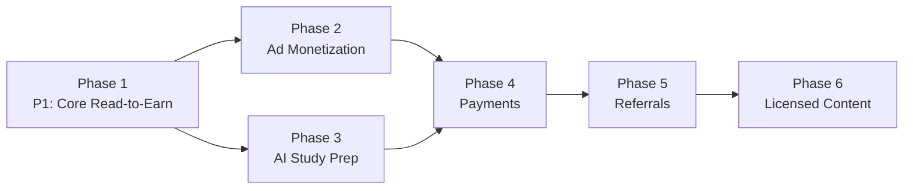

# PagePay: Complete Product Roadmap & System Architecture
*Last updated: June 2026*

---

## Design Philosophy
Ship every phase as a standalone, monetizing product. Each phase is an MVP, not a milestone to hide until completion.

---

## Phase 1: Read-to-Earn Core (Weeks 1–3)

**Goal:** Launch a functional read-to-earn mobile app on Play Store using free content.

### User Value
- Students and casual readers can read public domain books/news
- Earn confirmable points for verified reading time
- Points tracked live in a wallet

### Backend Build
- **FastAPI project init** with Python 3.11+
- **MySQL 8.0** database with async driver (`asyncmy` + SQLAlchemy 2.0 async)
  - Tables: `users`, `reading_sessions`, `content_catalog`, `ad_events`
- **JWT authentication** (email/phone + OTP or password)
- **Reading tracker API:**
  - `POST /api/v1/session/start` → starts timer, logs content_id
  - `POST /api/v1/session/heartbeat` → client pings every 10s, server validates scroll_velocity + foreground state
  - `POST /api/v1/session/end` → calculates points, commits to wallet
- **Admin endpoint:** bulk-import content from Gutendex/GNews
- **Deploy:** Docker container on Railway, Render, or any VPS (FastAPI + MySQL in separate containers or managed DB)

### Frontend Build (Expo SDK 55 — New Architecture mandatory)
- **Required SDK:** Expo SDK 55+ (React Native 0.83, React 19.2, New Architecture mandatory)
- **State management standard 2026:**
  - TanStack Query v5 for server state (feed, wallet)
  - Zustand for client state (theme, current book)
  - MMKV for persistent storage (auth tokens, preferences)
- **Navigation:** Expo Router (file-based routing in `app/` directory)
- **Folder architecture:** Feature-based (not file-type-based)

```
app/
  (auth)/
    login.tsx
    register.tsx
  (tabs)/
    _layout.tsx
    index.tsx          ← Home / Feed
    catalog.tsx        ← Book browser
    study.tsx          ← Phase 3
    wallet.tsx
  reader/
    [id].tsx           ← Dynamic: /reader/42
src/
  features/
    auth/
    catalog/
    reader/
    wallet/
    study/
  shared/
    api/
    components/
    hooks/
    utils/
```

- **Catalog tab:**
  - FlatList of book cards (title, cover placeholder, category, estimated earn)
  - Filter chips: Fiction | Non-Fiction | News | Classics
- **Reader screen:**
  - Clean scrollable text view
  - Floating progress indicator
  - Timer pill showing countdown to earning threshold
- **Wallet tab:**
  - Current balance display
  - Transaction history
  - "Withdraw" placeholder
- **Anti-cheat logic (client):**
  - `AppState` listener + `AppState.addEventListener('change', ...)`
  - `react-native-reanimated` scroll event on `FlashList` / `FlatList`
  - Timer pauses if scroll distance < 100px per 30s
  - Random "Read Check" modal every 5 articles

### Shippable Feature Set (Phase 1)
✅ User registration & login
✅ Browse and read public domain books + news
✅ Earn points for verified reading time
✅ Wallet balance tracking
✅ In-app anti-bot guardrails
✅ Live on Play Store as "PagePay: Read & Earn"

---

## Phase 2: Ad Monetization Foundation (Weeks 4–6)

**Goal:** Attach real revenue to every user interaction.

### Backend Build
- **Dual Ad Network scaffolding (AdMob + AppLovin MAX):**
  - `ad_placements` table (id, location, ad_type, priority, primary_provider, fallback_provider)
  - `ad_impressions` table (id, user_id, session_id, ad_type, ad_unit, provider, impression_revenue, timestamp)
  - Store ad unit IDs for BOTH AdMob and AppLovin in `app_config` table so you can swap or balance load without deploy
  - **Why dual networks:** AdMob provides highest global fill rate (especially Android). AppLovin MAX provides highest rewarded video eCPMs. Using both prevents single-network rate limiting, account review holds, or unexpected fill drops that can kill your daily revenue.
- **Server-Side Verification (SSV) endpoints:**
  - Webhook `POST /api/v1/ads/google/callback` (AdMob)
  - Webhook `POST /api/v1/ads/applovin/callback` (AppLovin MAX)
  - Idempotency checks using both providers' `transaction_id`
- **Native Ad feed generation:**
  - `GET /api/v1/content/feed/:user_id` → injects sponsored content slots every 4 articles
  - Sponsored entries flagged `is_sponsored: true`
  - Ad placement rotation logic: alternate between AdMob and AppLovin ad units per user session to distribute load
- **Reward multiplier logic:**
  - Base rate: 5 pts per 10 minutes
  - After article: "Watch video to double to 10 pts"
  - SSV from either provider confirms full watch → server bumps reward before commit

### Frontend Build
**CRITICAL 2026 NOTE:** Expo Go does NOT ship AdMob adapters. You MUST build a **Development Build** (`expo-dev-client`) with real native code to run AdMob/AppLovin in Expo SDK 55+.

- Use `expo-dev-client` + `react-native-google-mobile-ads` (AdMob) + AppLovin MAX React Native SDK + `@fumitakayamada/expo-applovin-max` (community plugin that handles Gradle/Pod injection for mediation adapters)
- **Dual network setup:** AdMob as mediation layer (fill rate backbone) + AppLovin MAX as a mediated network within AdMob OR as independent parallel SDK
  - Primary: AdMob handles banner, native, and interstitial for maximum fill rate
  - Secondary: AppLovin MAX handles rewarded video for highest eCPMs
  - Fallback: if one network fails to load, the other serves the ad — prevents blank ad slots and revenue loss
  - Load balancing: rotate ad unit IDs per session to avoid single-provider rate limits or account flags
- Use **Native Advanced (Custom) Ads** via AdMob styled to match app typography
- **Interstitial Ads:** trigger after every 3 articles (AdMob primary, AppLovin fallback)
- **Rewarded Video Ads:** modal after article complete with double-earn (AppLovin primary for eCPM, AdMob fallback)
- Initialize both SDKs on app startup so ad assets cache aggressively

### Shippable Feature Set (Phase 2)
✅ Native in-feed banner ads
✅ Rewarded video with server-side verification
✅ Interstitial ads on navigation
✅ Real ad revenue tracking
✅ Double-earn mechanic
✅ Play Store update: "PagePay: Read, Watch & Earn"

---

## Phase 3: Student AI Exam Prep (Weeks 7–10)

**Goal:** Attach high-retention student vertical to reduce churn and increase ad inventory per user.

### Backend Build
- **AI Provider Router (Python class):**
  - Priority queue based on task type and token count
  - Failover: catches 429 errors, auto-rolls to next provider
- **Table: `ai_provider_health`** tracks recent success rates per provider (circuit breaker pattern)
- **Study asset generation endpoints:**
  - `POST /api/v1/study/sow/upload` → accepts image or text
    - If image: OCR via Gemini Vision (multimodal)
    - Sends to Gemini for curriculum structure (1M ctx window)
  - `POST /api/v1/study/generate` → generates MCQ + flashcard + essay JSON
    - Route to Groq/Cerebras for speed (flashcards, quick quizzes)
  - `POST /api/v1/study/chat` → streaming Q&A on uploaded material
    - FastAPI `StreamingResponse` with generator for token-by-token delivery
- **Tables:**
  - `study_materials` (id, user_id, raw_input, parsed_structure, ai_model_used, created_at)
  - `quiz_sessions` (id, user_id, material_id, score, points_earned, questions, user_answers)
  - `payments` (id, user_id, amount_ngn, flutterwave_tx_ref, status, created_at, webhook_confirmed)

### AI Provider Assignment (2026 reality)

| Task | Primary Provider | Why | Fallback |
|------|-----------------|-----|----------|
| SOW/syllabus upload (heavy) | Gemini 2.5 Flash | 1M ctx window, free 100 req/day | Cerebras (1M tokens/day) |
| Real-time quiz / flashcard | Groq (Llama 3.3 70B) | 320 TPS, 1,000 req/day | Mistral (60 RPM, ~1B tokens/mo) |
| Chat / Q&A | Groq / Cerebras | Speed | OpenRouter (free models) |
| Circuit breaker | All providers | Track in DB; skip provider after 3 consecutive failures for 5 min | |

### Frontend Build
- **New "Study" tab** in bottom navigation (Expo Router)
- **SOW Upload UI:**
  - `expo-image-picker` for camera / gallery
  - `expo-document-picker` for PDF/text files
  - Loading state with `@shopify/react-native-skia` progress ring
- **Asset Browser:**
  - Accordion: MCQs | Flashcards | Essay Questions
  - MCQ: touchable single-choice buttons, instant feedback
  - Flashcard: `react-native-reanimated` tap-to-flip
  - Essay: typebox with AI-generated outline
- **Ad-gated answers:**
  - "Answer locked — watch 15s video to reveal"
  - "50 pts to unlock — Watch video free"
- **Points multiplier for study:**
  - Score ≥ 80%: bonus 20 pts
  - Completes study session → eligible for daily streak bonus

### Shippable Feature Set (Phase 3)
✅ SOW/scheme upload → AI structured outline
✅ Auto-generated MCQs, flashcards, essays
✅ Answer-gate via rewarded ads or points
✅ Streaming study chat (Q&A on material)
✅ Points for quiz performance
✅ Play Store update: "PagePay: Read, Study & Earn"

---

## Phase 4: Payments & Premium Tier (Weeks 11–13)

**Goal:** Diversify revenue beyond ads with direct user payments.

### Backend Build
- **Flutterwave v4 integration (OAuth 2.0):**
  - `POST /api/v1/payments/initiate` → returns payment URL / mobile money flow
  - Webhook `POST /api/v1/payments/flutterwave/callback` → confirms, updates tier, verifies signature hash
  - Idempotent: store `flutterwave_tx_ref` and verify no duplicate credits
- **Paystack fallback** behind feature flag, same schema
- **Subscription logic:**
  - `tier`: free | premium_monthly | premium_yearly
  - `subscription_expires_at` → cron job reverts to free tier when expired
  - Prevents over-provisioning
- **Tier-based config:**
  - Store prices, durations in `app_config` table for OTA price changes

### Frontend Build
- **Paywall screens:**
  - Two columns: "Free (Watch Ads)" vs "₦500 / month"
  - One-tap Flutterwave checkout (card, transfer, USSD, mobile money)
  - `expo-web-browser` for hosted payment page
  - Success state: instant premium unlock
- **Premium indicators:**
  - Gold badge on profile
  - No ad-gates on study materials
  - 2x reading points permanently
- **Billing history:** list of payments with dates

### Shippable Feature Set (Phase 4)
✅ One-tap Flutterwave checkout
✅ Monthly premium subscription (₦500–1,000)
✅ Ad-free premium experience for students
✅ Billing history
✅ Play Store update: "PagePay: Read, Study, Learn & Earn"

---

## Phase 5: Referrals & Community (Weeks 14–18)

**Goal:** Network effects to reduce CAC and increase retention.

### Backend Build
- **Referral system:**
  - `POST /api/v1/referral/generate` → unique referral code
  - `GET /api/v1/referral/stats`
  - Both referrer and referee get bonus on first verified session
  - Server validates referee completed reading session before awarding referrer
- **Content library expansion:**
  - Cron sync Hive blockchain posts hourly
  - Add RSS feeds for tech, sports, politics
  - Pre-approve Taboola/Outbrain application during this phase
- **Admin dashboard:** cohort retention, top content, AI cost per user

### Frontend Build
- **Referral share sheet:** `expo-sharing` with pre-filled WhatsApp/X message
- **Community section:** browse notes uploaded by other students
- **Advanced catalog:** continue reading carousel, basic recommendations
- **Reading streak counter**

### Shippable Feature Set (Phase 5)
✅ Referral rewards program
✅ Community study notes feed
✅ Advanced book discovery
✅ Baseline analytics
✅ Play Store update: "PagePay: Learn, Read, Refer & Earn"

---

## Phase 6: Licensed Content & Scale (Weeks 19+)

**Goal:** Replace placeholder content with licensed/syndicated material.

### Backend Build
- **Content provider abstraction:**
  - Unified interface: `get_article(id)`, `search(query)`, `get_feed(category, page)`
  - Implement adapters for: Taboola, GNews, NewsBreak, Hive
  - Feature flags `content_sources` table to toggle without deploy
- **Revenue-share reconciliation:** daily import of partner earnings

### Frontend Build
- **Taboola native widget** within reader
- **"Sponsored Reading"** section with clear labeling
- **Region auto-detection** via `expo-localization`

### Shippable Feature Set (Phase 6)
✅ Licensed news integration (Taboola/Outbrain)
✅ Sponsored content feed
✅ Revenue-share reconciliation
✅ Regional content variants
✅ "PagePay: Global Read-to-Earn Platform"

---

## System Architecture

```
┌─────────────────────────────────────────────────────────────────────┐
│                         CLIENT TIER                                 │
│  ┌───────────────────────────────────────────────────────────────┐ │
│  │              Expo SDK 55 (New Architecture)                  │ │
│  │  expo-router  │  expo-dev-client  │  expo-updates (OTA)     │ │
│  │  TanStack Query v5  │  Zustand  │  MMKV                     │ │
│  └──────────────────────────────────────────────────────────────┘ │
│                            │ HTTPS                                  │
└────────────────────────────┼───────────────────────────────────────┘
                             │
┌────────────────────────────▼───────────────────────────────────────┐
│                    FASTAPI BACKEND (Docker)                         │
│  ┌──────────────────────────────────────────────────────────────┐  │
│ │  AI ROUTER (single endpoint, provider selection)              │  │
│ │  POST /api/v1/ai/route → Gemini / Groq / Cerebras / Mistral   │  │
│  └──────────────────────────────────────────────────────────────┘  │
│  ┌──────────────────────────────────────────────────────────────┐  │
│ │  READING ENGINE  │  AD SSV VERIFIER  │  REFERRAL ENGINE       │  │
│  └──────────────────────────┬───────────────────────────────────┘  │
│                             │                                       │
│  ┌──────────────────────────▼───────────────────────────────────┐  │
│ │  MySQL 8.0 (asyncmy + SQLAlchemy 2.0 async)                  │  │
│ │  users │ wallets │ sessions │ ad_events │ study_materials    │  │
│ │  quiz_history │ payments │ referrals │ content_catalog       │  │
│  └──────────────────────────────────────────────────────────────┘  │
└──────────────────────────────────────────────────────────────────┘
                             │
              ┌───────────────┼───────────────┐
              ▼               ▼               ▼
     ┌─────────────────┐ ┌───────────┐ ┌──────────────────┐
      │ CONTENT FEEDS   │ │ AI PROVIDERS│ │ AD NETWORKS          │
      │ • Gutendex      │ │ • Gemini   │ │ • Google AdMob       │
      │   (public domain)│ │ • Groq     │ │   (fill rate anchor) │
      │ • GNews (free)  │ │ • Cerebras │ │ • AppLovin MAX       │
      │ • Hive API      │ │ • Mistral  │ │   (rewarded eCPM)    │
      │ • RSS           │ │ • OpenRouter│ │ (dual for load share)│
     └─────────────────┘ └───────────┘ └──────────────────┘
                             │
                    ┌─────────▼─────────┐
                    │ PAYMENT GATEWAYS  │
                    │ • Flutterwave v4  │
                    │ • Paystack        │
                    └───────────────────┘
```

---

## AI Router Logic (Python code pattern)

```python
import logging
from tenacity import retry, stop_after_attempt

PROVIDERS = [
    {"name": "gemini", "model": "gemini-2.5-flash", "rpd": 1500, "rpm": 15, "try": call_gemini},
    {"name": "cerebras", "model": "gpt-oss-120b", "rpd": 1000000, "rpm": 5, "try": call_cerebras},
    {"name": "groq", "model": "llama-3.3-70b-versatile", "rpd": 1000, "rpm": 30, "try": call_groq},
    {"name": "mistral", "model": "mistral-small-latest", "rpm": 60, "try": call_mistral},
    {"name": "openrouter", "model": "deepseek/deepseek-chat:free", "rpd": 50, "rpm": 20, "try": call_openrouter},
]

async def route_ai(prompt: str, task_type: str):
    # Filter providers compatible with task type
    candidates = [p for p in PROVIDERS if p["name"] not in get_circuit_open()]
    
    for provider in candidates:
        try:
            return await provider["try"](prompt)
        except RateLimitError:
            mark_failed(provider["name"])
            continue
        except Exception as e:
            logging.warning(f"{provider['name']} error: {e}")
            continue
    
    raise HTTPException(503, "All AI providers temporarily saturated.")
```

---

## Database Schema (SQLAlchemy 2.0 async models)

```python
from sqlalchemy.orm import DeclarativeBase, Mapped, mapped_column
from sqlalchemy import String, Integer, BigInteger, Boolean, Text, DateTime, Enum
from datetime import datetime
import enum

class Base(DeclarativeBase):
    pass

class UserTier(enum.Enum):
    FREE = "free"
    PREMIUM_MONTHLY = "premium_monthly"
    PREMIUM_YEARLY = "premium_yearly"

class User(Base):
    __tablename__ = "users"
    id: Mapped[int] = mapped_column(BigInteger, primary_key=True, index=True)
    email: Mapped[str | None] = mapped_column(String(255), unique=True, index=True)
    phone: Mapped[str | None] = mapped_column(String(20), unique=True, index=True)
    password_hash: Mapped[str | None] = mapped_column(String(255))
    points_balance: Mapped[int] = mapped_column(BigInteger, default=0)
    tier: Mapped[UserTier] = mapped_column(Enum(UserTier), default=UserTier.FREE)
    referral_code: Mapped[str | None] = mapped_column(String(12), unique=True)
    referred_by: Mapped[str | None] = mapped_column(String(12), index=True)
    subscription_expires_at: Mapped[datetime | None] = mapped_column(DateTime, nullable=True)
    created_at: Mapped[datetime] = mapped_column(DateTime, default=datetime.utcnow)
    last_active_at: Mapped[datetime | None] = mapped_column(DateTime, nullable=True)

class ReadingSession(Base):
    __tablename__ = "reading_sessions"
    id: Mapped[int] = mapped_column(BigInteger, primary_key=True, index=True)
    user_id: Mapped[int] = mapped_column(BigInteger, index=True)
    content_id: Mapped[int] = mapped_column(BigInteger, index=True)
    start_time: Mapped[datetime] = mapped_column(DateTime, default=datetime.utcnow)
    end_time: Mapped[datetime | None] = mapped_column(DateTime, nullable=True)
    duration_seconds: Mapped[int] = mapped_column(BigInteger, default=0)
    points_earned: Mapped[int] = mapped_column(BigInteger, default=0)
    verified: Mapped[bool] = mapped_column(Boolean, default=False)
    scroll_events: Mapped[int] = mapped_column(BigInteger, default=0)

class ContentCatalog(Base):
    __tablename__ = "content_catalog"
    id: Mapped[int] = mapped_column(BigInteger, primary_key=True, index=True)
    title: Mapped[str] = mapped_column(String(500))
    content_type: Mapped[str] = mapped_column(String(50))  # book, article, news
    category: Mapped[str] = mapped_column(String(100), index=True)
    source_url: Mapped[str | None] = mapped_column(String(500))
    body_text: Mapped[str | None] = mapped_column(Text)
    author: Mapped[str | None] = mapped_column(String(255))
    cover_image_url: Mapped[str | None] = mapped_column(String(500))
    estimated_read_minutes: Mapped[int] = mapped_column(Integer, default=5)
    is_sponsored: Mapped[bool] = mapped_column(Boolean, default=False)
    created_at: Mapped[datetime] = mapped_column(DateTime, default=datetime.utcnow)

class AdEvent(Base):
    __tablename__ = "ad_events"
    id: Mapped[int] = mapped_column(BigInteger, primary_key=True, index=True)
    user_id: Mapped[int] = mapped_column(BigInteger, index=True)
    session_id: Mapped[int | None] = mapped_column(BigInteger, nullable=True)
    ad_type: Mapped[str] = mapped_column(String(50))  # rewarded, interstitial, native
    ad_unit: Mapped[str] = mapped_column(String(100))
    provider: Mapped[str] = mapped_column(String(50))  # admob, applovin
    impression_revenue_usd: Mapped[float | None] = mapped_column(BigInteger, nullable=True)
    watched_fully: Mapped[bool] = mapped_column(Boolean, default=False)
    reward_granted: Mapped[bool] = mapped_column(Boolean, default=False)
    transaction_id: Mapped[str | None] = mapped_column(String(255), unique=True, nullable=True)
    created_at: Mapped[datetime] = mapped_column(DateTime, default=datetime.utcnow)

class StudyMaterial(Base):
    __tablename__ = "study_materials"
    id: Mapped[int] = mapped_column(BigInteger, primary_key=True, index=True)
    user_id: Mapped[int] = mapped_column(BigInteger, index=True)
    raw_input: Mapped[str] = mapped_column(Text)
    parsed_structure: Mapped[str | None] = mapped_column(Text, nullable=True)
    ai_model_used: Mapped[str | None] = mapped_column(String(100), nullable=True)
    created_at: Mapped[datetime] = mapped_column(DateTime, default=datetime.utcnow)

class QuizSession(Base):
    __tablename__ = "quiz_sessions"
    id: Mapped[int] = mapped_column(BigInteger, primary_key=True, index=True)
    user_id: Mapped[int] = mapped_column(BigInteger, index=True)
    material_id: Mapped[int | None] = mapped_column(BigInteger, nullable=True)
    score: Mapped[int | None] = mapped_column(Integer, nullable=True)
    points_earned: Mapped[int] = mapped_column(BigInteger, default=0)
    questions: Mapped[str | None] = mapped_column(Text, nullable=True)
    user_answers: Mapped[str | None] = mapped_column(Text, nullable=True)
    created_at: Mapped[datetime] = mapped_column(DateTime, default=datetime.utcnow)

class Payment(Base):
    __tablename__ = "payments"
    id: Mapped[int] = mapped_column(BigInteger, primary_key=True, index=True)
    user_id: Mapped[int] = mapped_column(BigInteger, index=True)
    amount_kobo: Mapped[int] = mapped_column(BigInteger)  # NGN in kobo (₦500 = 50000)
    flutterwave_tx_ref: Mapped[str | None] = mapped_column(String(255), unique=True, nullable=True)
    provider: Mapped[str] = mapped_column(String(50))  # flutterwave, paystack
    status: Mapped[str] = mapped_column(String(50), default="pending")  # pending, success, failed
    tier_granted: Mapped[str | None] = mapped_column(String(50), nullable=True)
    webhook_confirmed: Mapped[bool] = mapped_column(Boolean, default=False)
    created_at: Mapped[datetime] = mapped_column(DateTime, default=datetime.utcnow)

# FastAPI lifespan (SQLAlchemy 2.0 async pattern)
from contextlib import asynccontextmanager

@asynccontextmanager
async def lifespan(app: FastAPI):
    async with engine.begin() as conn:
        await conn.run_sync(Base.metadata.create_all)
    yield
```

---

## Phase Dependency Map



---

## Risk Controls Per Phase

| Phase | Primary Risk | Mitigation |
|-------|-------------|------------|
| 1 | Zero content depth | Start with 50 curated public domain chapters + 200 GNews articles |
| 2 | Single ad network fill/eCPM drop or account ban | Implement client-side scroll validation + server heartbeat checks BEFORE SSV; test with test ads 2 weeks; run both AdMob and AppLovin simultaneously for fill redundancy and eCPM competition |
| 3 | AI hallucination in study material | Add "Report wrong answer" button; per-session disclaimer "AI-generated, verify with textbook" |
| 4 | Payment gateway stress | Use Flutterwave v4 sandbox 30 days; test webhook idempotency thoroughly |
| 5 | Referral abuse | Cap daily referral bonuses; server validates referee completed 5-min verified reading session |
| 6 | Content licensing costs | Negotiate Taboola first (no upfront cost); defer NewsBreak until proven DAU |

---

## Content Provider Status (June 2026)

| Provider | Auth Required | Free Quota | Revenue Share | Launch Ready |
|----------|--------------|------------|---------------|--------------|
| **Gutendex / Gutenberg** | No | Unlimited | Yes (commercial reuse, keep PG license) | **Yes — Day 1** |
| **GNews** | API key | 100 req/day free | No (your AdMob owns monetization) | **Yes — Day 1** |
| **NewsAPI.org** | API key | 100 req/day dev | No | **Yes — Day 1** |
| **Hive Blockchain** | No | Unlimited | Yes (c curation rewards) | **Yes — but Web3 complexity** |
| **Taboola/Outbrain** | Yes | N/A | Yes (revenue share) | **No — requires live DAU proof** |
| **Wattpad Enterprise** | Yes | N/A | Yes (revenue share) | **No — B2B contract, not self-serve** |
| **NewsBreak** | Yes | N/A | Yes (revenue share) | **No — selective approval, needs traffic** |

---

## AI Provider Status (June 2026)

| Provider | Free Tier | No Credit Card | Commercial Use | Fragility |
|----------|-----------|----------------|----------------|-----------|
| **Google AI Studio** | Gemini 2.5 Flash: ~1,500 req/day, 1M ctx | Yes | Yes | Stable — reduced from 2025 levels, but reliable |
| **Groq** | ~1,000 req/day, 30 RPM | Yes | Yes | Stable — no surprises |
| **Cerebras** | ~1M tokens/day, 5 RPM | Yes (previously required card, now free) | Yes | **Volatile** — catalog dropped from 12 models to 2 in 2026; hardcode model names at your risk |
| **Mistral** | ~1B tokens/month Experiment tier | Yes | **No** — data used for training | Requires paid tier for production data |
| **OpenRouter** | 20+ free models, 20 RPM, 50 req/day | Yes | Yes | Stable — single key replaces 5 accounts |
| **GitHub Models** | ~150 req/day (various models) | Yes | Caveats | Moderate — limited but reliable |

**Decision for PagePay:**
1. Primary: Gemini Flash (heavy SOW uploads, 1M context)
2. Secondary: Groq (real-time quizzes, fastest open-weight)
3. Tertiary: OpenRouter free models (failover, no-card single-key simplicity)
4. Optional add: Cerebras if you need massive batch tokens (but watch the catalog volatility)
